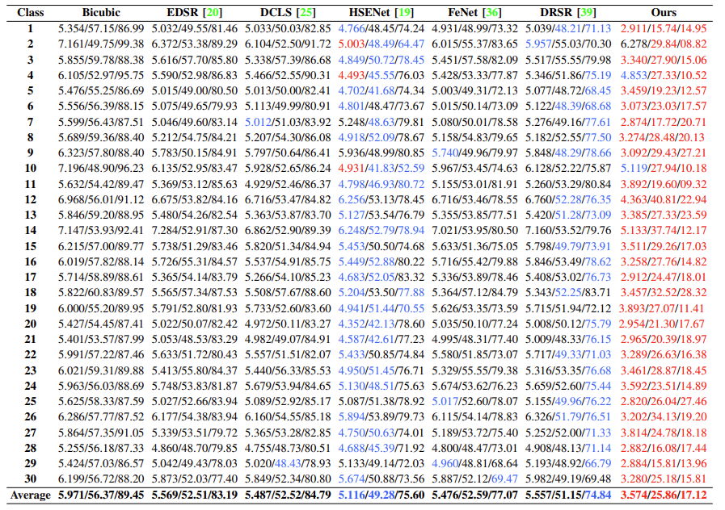
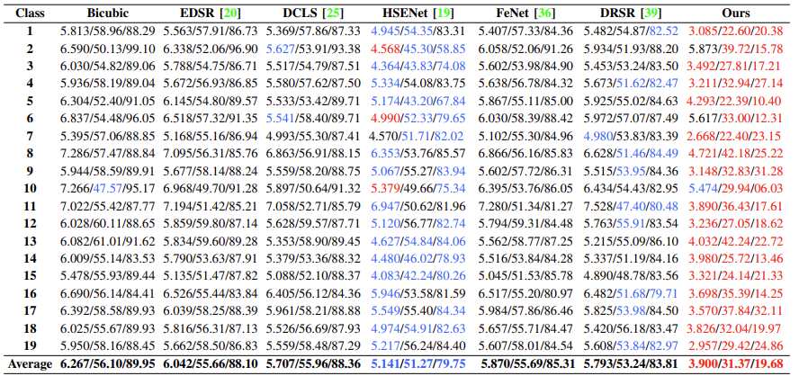
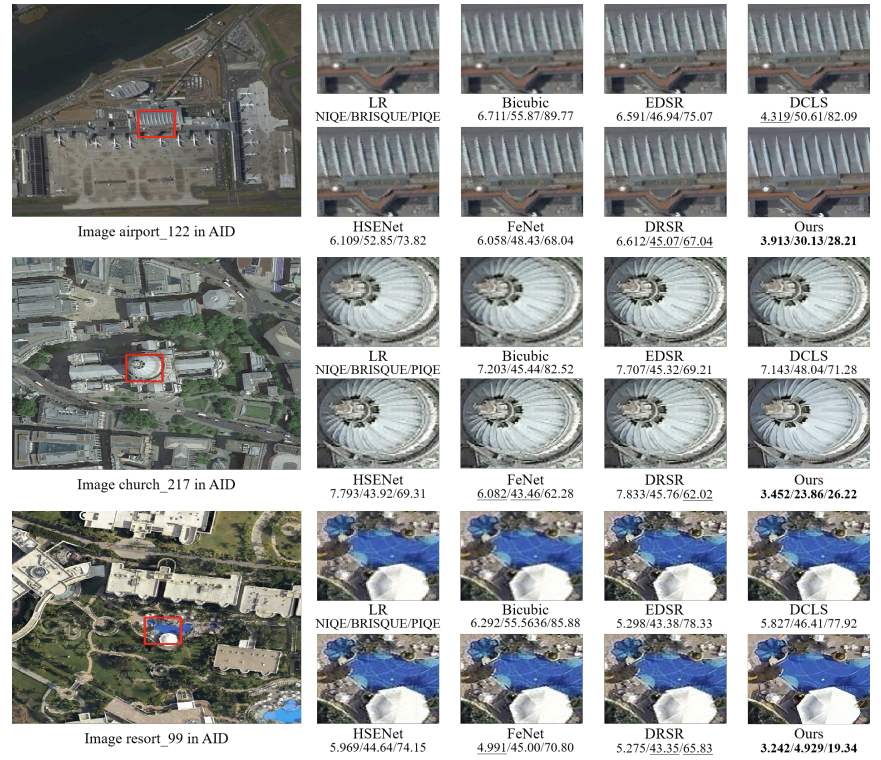
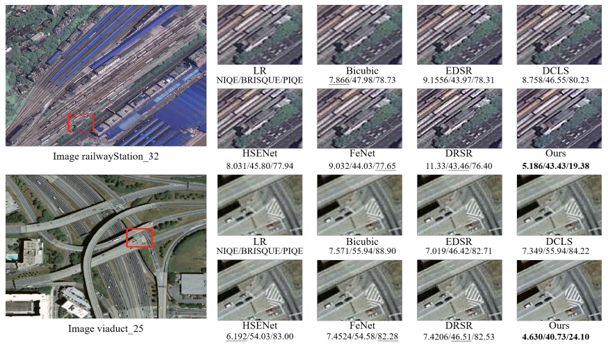
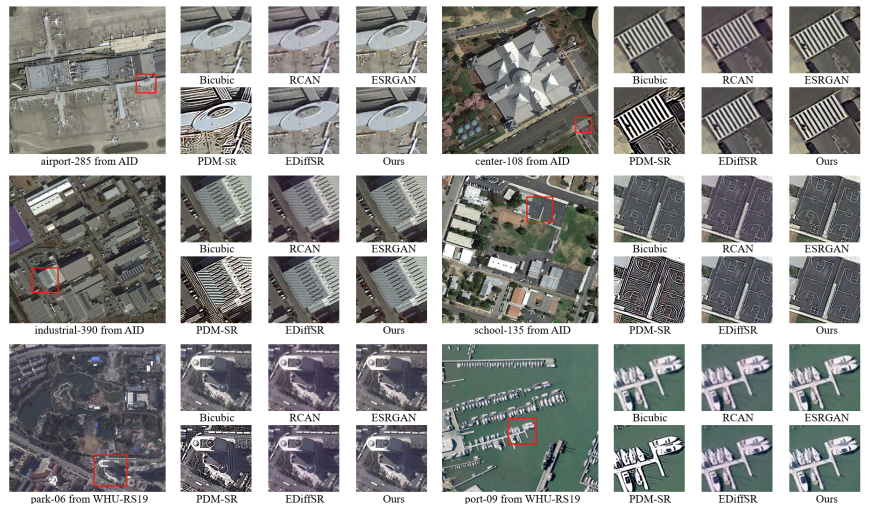

# UDASR: Unsupervised Degradation Aware and Representation for Real-World Remote Sensing Image Super-Resolution

## Code: 

Code coming soon....

## Installation
```
sudo apt-get update
sudo apt install tmux
sudo apt install libgl1-mesa-glx
pip3 install basicsr --index-url http://pypi.douban.com/simple --trusted-host pypi.douban.com
pip3 install pandas --index-url http://pypi.douban.com/simple --trusted-host pypi.douban.com
sudo python3 setup.py develop
#sudo pip uninstall bytedmetrics
pip3 install einops --index-url http://pypi.douban.com/simple --trusted-host pypi.douban.com
pip3 install lpips --index-url http://pypi.douban.com/simple --trusted-host pypi.douban.com

pip3 install torchsummary --index-url http://pypi.douban.com/simple --trusted-host pypi.douban.com
```

## Start up
To get a quick start:

```bash
cd codes/config/UDASR/
python3 test.py --opt options/RS/UDASR-test-x4.yml
#You should change the corresponding model weights and dataset paths to your corresponding paths.
```

## Results

###  Quantitative comparisons on the AID dataset with upscale ×4.



### Quantitative comparisons on the WHU-RS19 dataset with upscale ×4.



### Some visual comparisons.

#### **Quality Result-1:**



**Quality Result-2:**



**Quality Result-3:**




## Contact
Should you have any question, please contact 55dupup@gmail.com

